# IBM INNOVATION DAY

October 22, 2025

# Zero to Workflow: Create Fast with Low-Code/No-Code Magic

## Where Code Meets Concert – Exercise Guide 1

### 1. Concert Workflows Exercise

In this Exercise Guide, you will explore IBM Concert Workflows. Concert Workflows is IBM’s no-code, lowcode automation solution for network and related automation. Concert Workflows makes it easy for just about anybody in your organization to automate tasks that they might perform regularly. It saves you time and helps to reduce errors that might be made when these tasks are performed manually. To begin the exercise, you should already be signed into the Concert Workflows dashboard. 

#### 1.1	Introduction and the Concert Workflows dashboard 
1.	In this exercise, we are going to provide an overview of the Concert Workflows platform. This platform is used to normalize automation across entire organizations, making it easy for technical and nontechnical users to rapidly build automations and orchestrate these automations across the business, helping ensure that automation is not siloed within certain teams. Concert Workflows helps users connect all the various platforms that exist in their environment with its vast integration library. And when an integration is not available on the platform, IBM has a service level objective (SLO) to provide the integration within 15 business days. That means clients can request a new integration for any publicly available application programming interface (API) to be added to the platform to make it part of their automations in a couple of weeks. Concert Workflows allows all the tools in your organization to have automation capability with its ability to trigger APIs for every workflow. Existing automations are amplified by including them in new workflows. Automation governance is improved by centralizing automations, and access to automations across your organization can easily be managed by role-based access control (RBAC), making it available for teams based on their skill level and ability. Finally, there's a library of templates and integrations available for Concert Workflows users that they can immediately start to consume and start building automations and get more inspiration for what is possible with the platform. 

    URL: [IBM Concert Workflows](https://itzvsi-120000d9ty-shvd08ct/workflows) 
    Username and password will be provided by the instructor.

2.	The Concert Workflows dashboard is the first screen that you see when you sign in. The dashboard uses tiles to link to the main areas of Concert Workflows. Workflows lets you create, debug, and run workflows. Automation Center lets you organize and monitor the execution of your automations. This is how your automations are going to be used by operations teams and other organizations that are looking for data. Jobs lets you schedule and manage jobs for auditing purposes or to evaluate solutions to ensure that they are operating correctly. And Authentications lets you create and manage authentications, which allow Concert Workflows to interact with network devices, servers, and other applications. 
 
    **When you are logged into IBM Concert Workflows, notice the Workflows (A), Automation Center (B), Jobs (C), and Authentications (D) tiles.**
 
    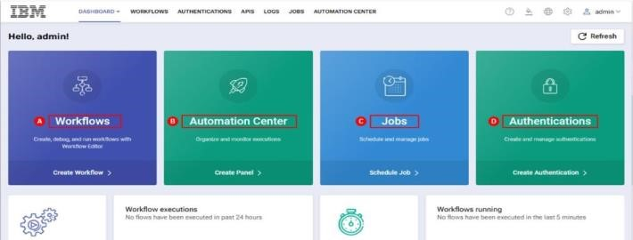

3.	At the bottom of each tile is a shortcut link to create a new item. For example, the Create Workflow link opens the Workflows page with a dialog already opened to create a new workflow. 
 
    **See the Create Workflow (A) link.**

    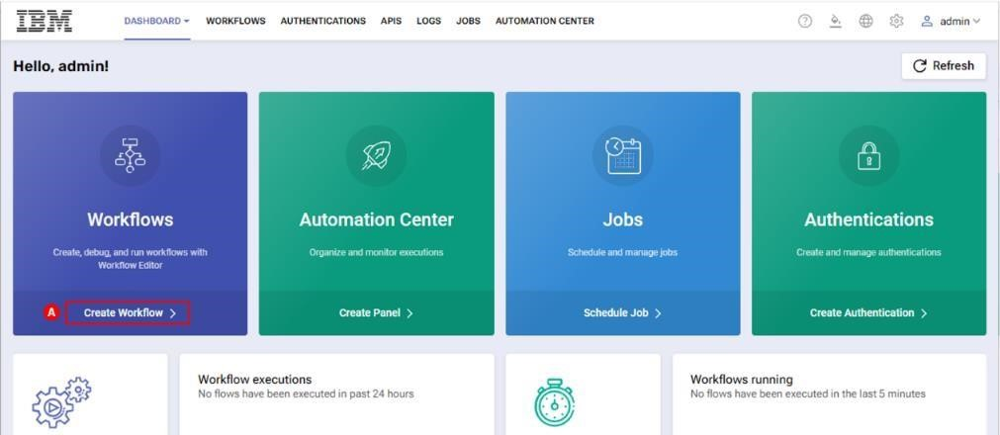

4.	The dashboard also shows you a summary of recent workflow executions and currently running workflows. 
 
    **Have a look at the Workflow executions (A) and Workflows running (B).**
 
    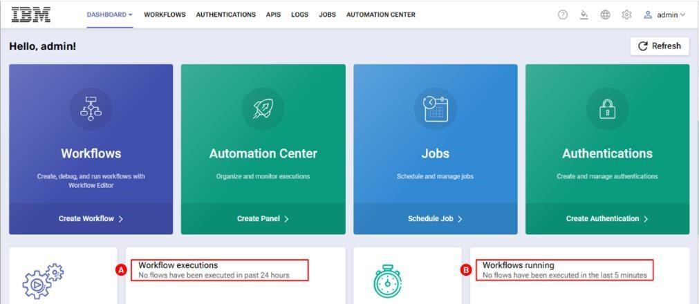

#### 1.2	Exploring workflows 
1.	Start with workflows. 

    **Action: Click Workflows (A).**

    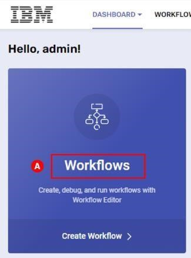

2.	This brings you into a folder structure of workflows. 
 
     **Look at the Workflows folder structure (A).**

    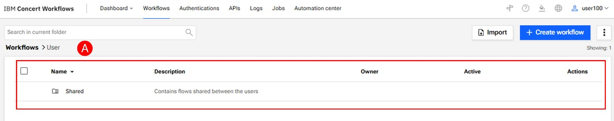

 
3.	Everything in Concert Workflows is written in either Yet Another Markup Language (YAML) or JavaScript Object Notation JSON). So, you can configure Git and store your workflows in a Git repository to maintain your automation and other coding practices. 
 
    **Action: Expand the 3-dot menu and point to the Git config (A) menu option.**
 
    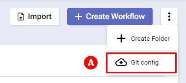
 
4.	The SSH workflow is the one you’re interested in. This workflow proactively connects to a server and looks for directories with high utilization so that steps can be taken to manage that utilization. 
 
    **Action: Click on Shared -> admin -> User -> HandsOn Lab 1 folders to see the SSH-df-h workflow (A). Click on the Workflow name to open the workflow editor.**
 
    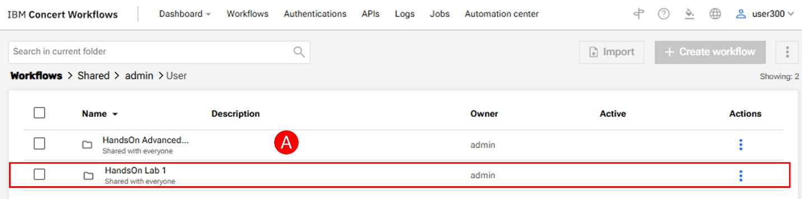

5.	Now, we are in the workflow editor. In the center is the workflow itself, and on the left, you can see the vast library of integrations that are available in Concert Workflows. 
 
    **Action: Notice the workflow (A) and the integration library (B).**

    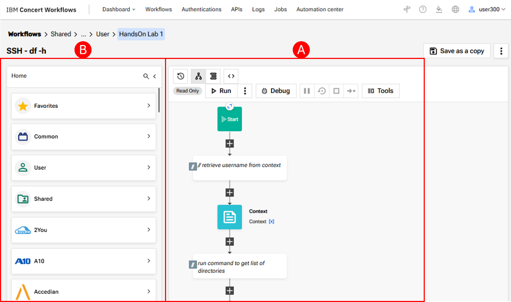
 
6.	Within the workflow, you can see the SSH integration that is the focus of the workflow. From this or any other block, you can easily locate that integration in the library. 
 
    **Action: Hover over the SSH block to reveal the vertical ellipsis (A) and click the Locate (B) option. Then, point to the SSH (C) integration on the left.**

    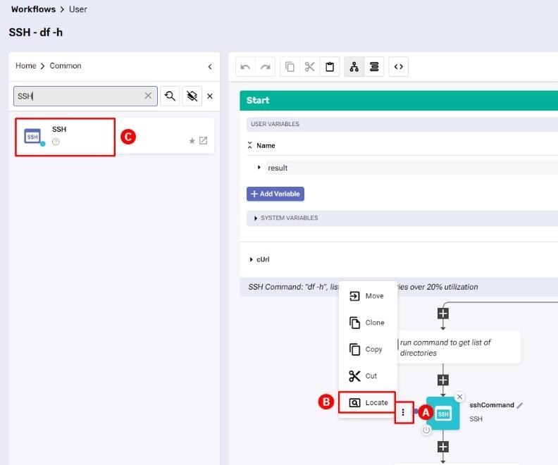

7.	To include a block in your workflow, drag it over and complete the details. For the SSH integration, authentication to the server is the most important detail. 
 
    **Action: Drag the SSH (A) integration and drop it on the plus sign (B) under the existing SSH block in the workflow editor. Then select the authKey (C) for the SSH authentication “admin/SSH-VM” that was created for the exercise earlier.**
    >**Important: Hover over the new SSH block and click the X (D) to discard it before continuing.**

    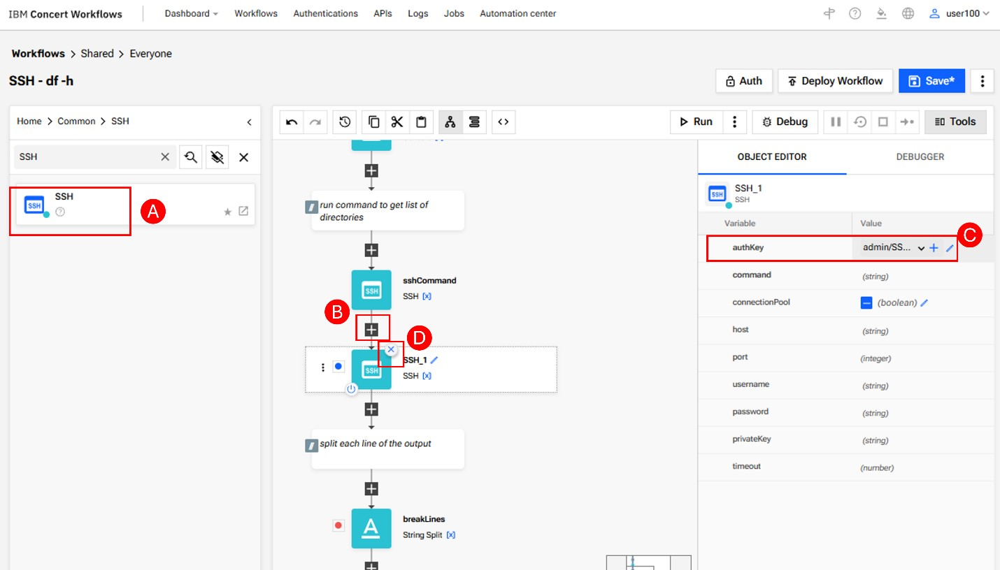

8.	Concert Workflows has many integrations that have been requested by the industry and clients. If there's a publicly available integration that's not here, then the Concert Workflows team can add it within 15 business days, assuming it's documented with Swagger, OpenAPI, or the like. If you already have automation within your organization, Concert Workflows leverages Ansible, Terraform, and even Python. 
 
    **Action: Click the Home (A) link in the integrations library to clear the previous search, enter faas in the Search (B) field, and then click FaaS (C) to reveal the Python integrations.**

    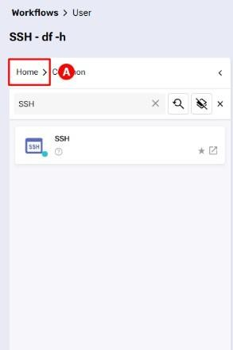 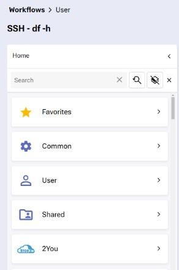 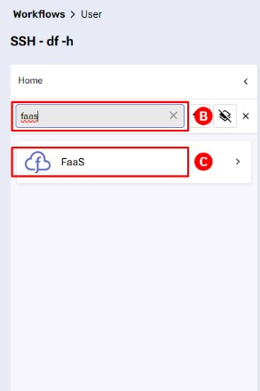 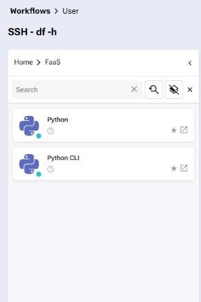

9.	For example, you can drag a Python block right into your workflow and paste in your code. 
 
    **Action: Drag the Python (A) integration and drop it on the plus sign (B) above the existing SSH block. A Python (C) block appears in the workflow editor. Click the edit (D) icon in the Object Editor on the right. The code editor appears. Click the X (E) to close the editor.**
    >**Important: Hover over the**

    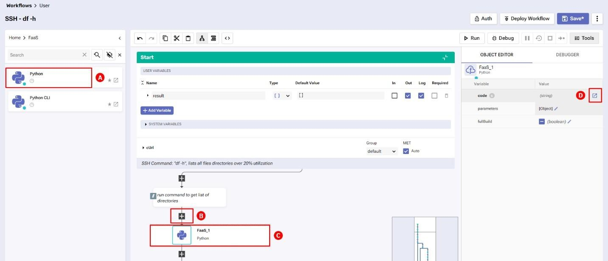
    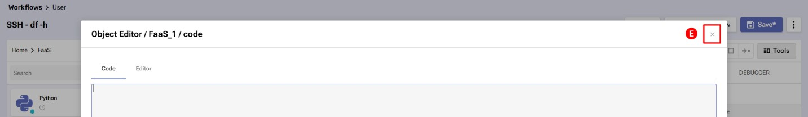

#### 1.3	Examining the SSH workflow 
1.	Take a closer look at this SSH workflow. It uses the Linux df command to get information about the available space on mounted file systems. It then formats and examines the output to identify directories with high utilization and opens a ServiceNow incident for any directory with excessively high utilization. A breakpoint has been set after the SSH block so you can run the workflow in debug mode and examine the results of the SSH block before continuing. 
 
    **Action: Click on breakLines object (A) and click the Debug (B) button. If you get a message indicating that running the script will autosave it, click Save to proceed.**

    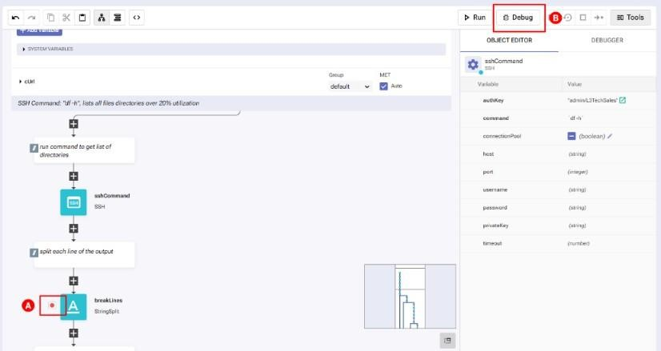

2.	The workflow paused after running the SSH command as expected. Now, you can look at the SSH results, including the output from the df command and any errors that occurred. 
 
    **Action: Click the edit (A) icon next to the sshCommand and point to the results (B). Click the Cancel (C) button to close the window.**

    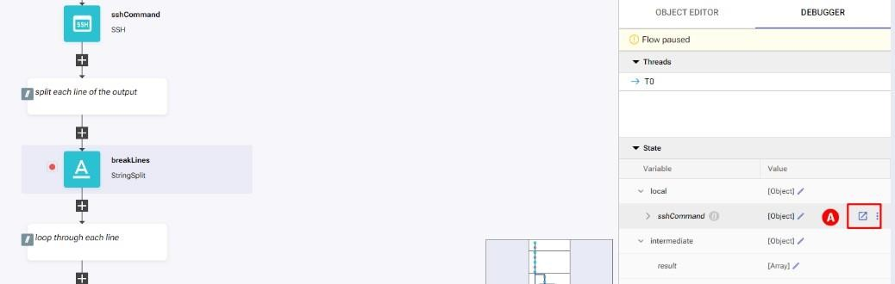
    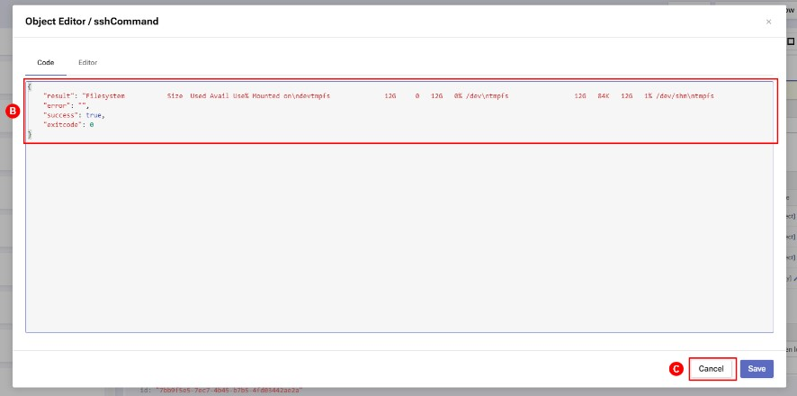

3.	You can also see a convenient summary of the results without even going into the editor, and if you hover over the result value, the full results pop up. 
 
    **Action: Expand the sshCommand results by clicking the expand (A) icon and then hover over the result value.**

    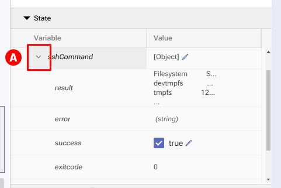

4.	As you can see, the results are unusable in their current form, which is why the next several stages of the workflow reformat the data to break the output into separate lines and loop through the lines to remove the header line, break each remaining line into components, and remove extra spaces. 
 
    **Action: Scroll through the workflow and have a look at the stages: breakLines (A), afterHeader (B), breakString (C), and removeSpaces (D).**

    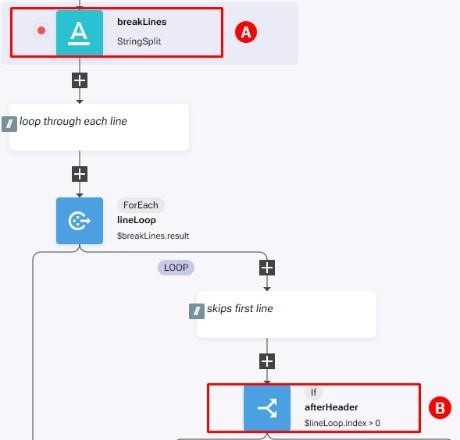 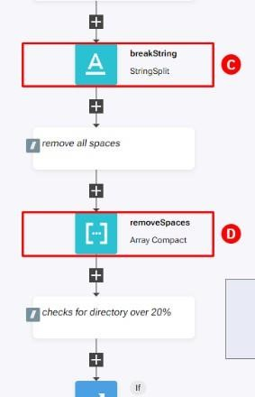

5.	With the output formatted, each directory can be checked for its utilization. 
 
    **Action: Point to the parseFloat (A) stage.**

    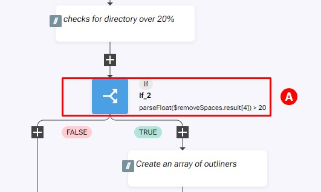

6.	The next stage of the workflow opens incident in ServiceNow for any directories with high utilization so they can be addressed. 
 
    **Action: Have a look at the ServiceNow (A) stage.**

    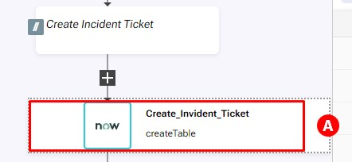

7.	Now, we will terminate the debug mode and run the full workflow. The result will show the directories that are over the utilization threshold, so incidents should get opened in ServiceNow. 
 
    **Action: Click the stop (A) icon to terminate debug mode, and then click the Run (B) button. Finally, point to the result (C).**

    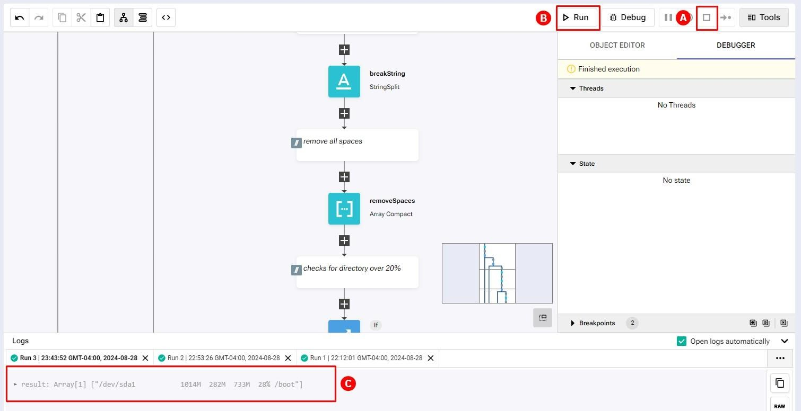

#### 1.4	Viewing an incident generated by a workflow in ServiceNow 
1.	You should now find a new incident in ServiceNow. 

    **Username and password information will be provided by the instructors**
 
    **Action: Log into ServiceNow in your browser and navigate to the [Incidents page](https://dev222752.service-now.com/now/nav/ui/classic/params/target/incident_list.do). Click the Run (A) button to refresh the incident list and point to a newly opened incident (B).**

    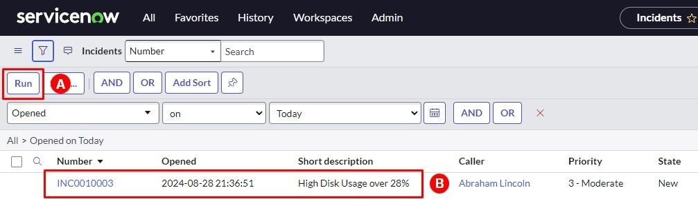

2.	When you open the incident details, you can see that it contains everything that is needed to resolve the issue, including a description of the issue and the directory that is over the utilization threshold. 
 
    **Action: Click the Incident Number (A) and then point to the Short Description and Description (B) of the incident. Return to the Concert Workflows browser tab.**

    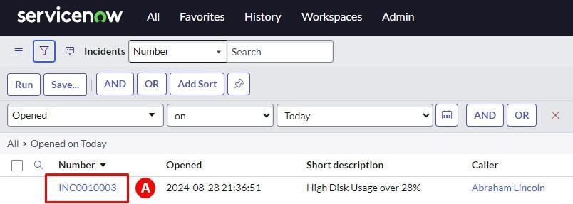
    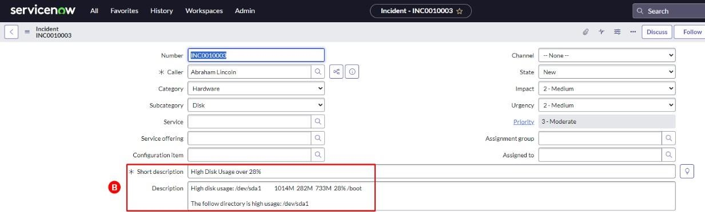

#### 1.5	Deploying a workflow 
1.	You’ll probably want to run such a useful workflow regularly. You can accomplish this within the platform or by deploying a RESTful application programming interface (API) endpoint. To deploy an API endpoint, we will use the Deploy Workflow button. First, we need to create an API and a stage.

2.	Create an API. 
 
    ** Action: In the Concert Workflows dashboard, click the APIs (A) tab near the top of the screen. Click the Create API (B) button.**

    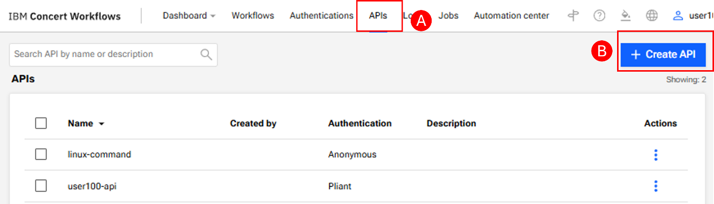

    **Enter a Name (A) as follow: linux-command-user123 with your dedicated username at the end. Under General Settings, select Worker group as default, under Authentications, select Authentication as Anonymous, and then click the Create button. If you see a screen indicating that there are no workflow deployments created yet, you can ignore it.**

    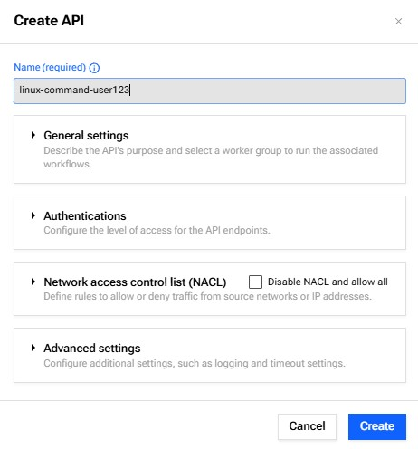

3.	Create an API stage. 
 
    **Action: Click the Stages (A) link and then click the Create Stage (B) button.**

    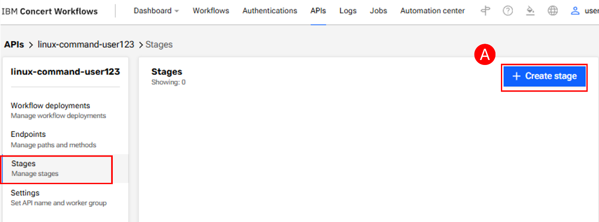

    **Enter the Name (A)  ‘prod’ and click the Create (B) button.**

    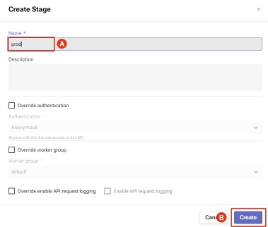

4.	Now, we will go back to the SSH-df-h Workflow to deploy it.  
 
    **Action: Go back to Workflows -> Shared -> admin -> User -> HandOn Lab 1 -> SSH-df-h workflow.  Click on the Deploy Workflow button on the top right.**

    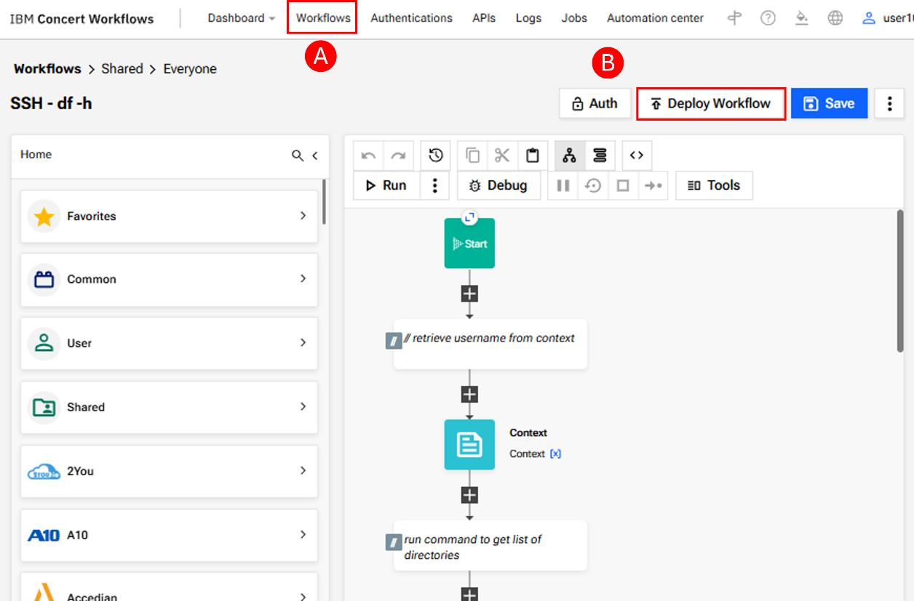

5.  Fill out the information to deploy as follows.

    **Action: Click on the API Name (A) field. Choose the API that you created in the previous steps e.g. linux-command-user123 with your dedicated username.**

    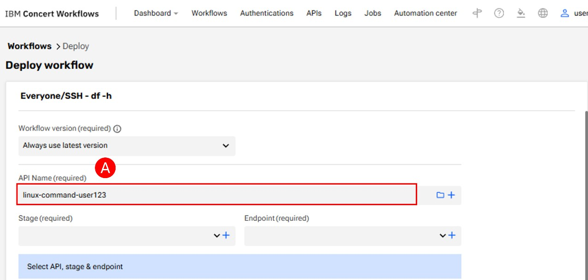

6.	Attach the endpoint to your production. 
 
    **Action: Select the prod (A) stage and click the plus sign (B) next to the Endpoint field.**

    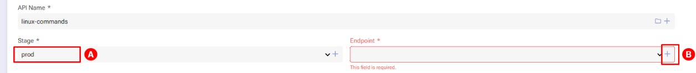

7.	Give your endpoint a name and select the API method. All the standard API methods are available, like Get, Put, and Delete. Get is appropriate for this endpoint. 
 
    **Action: In the Path (A) field, enter a dedicated name with your username e.g. 
user123/getDiskUsage. Drop down the Method (B) menu and select Get. Click Create.**

    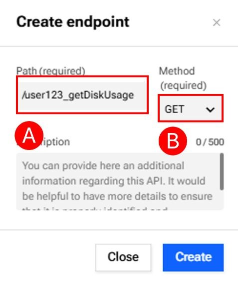

8.	The endpoint can now be copied to your clipboard and deployed. 
 
    **Action: Click the Copy (A) button and then click the Deploy (B) button.**

    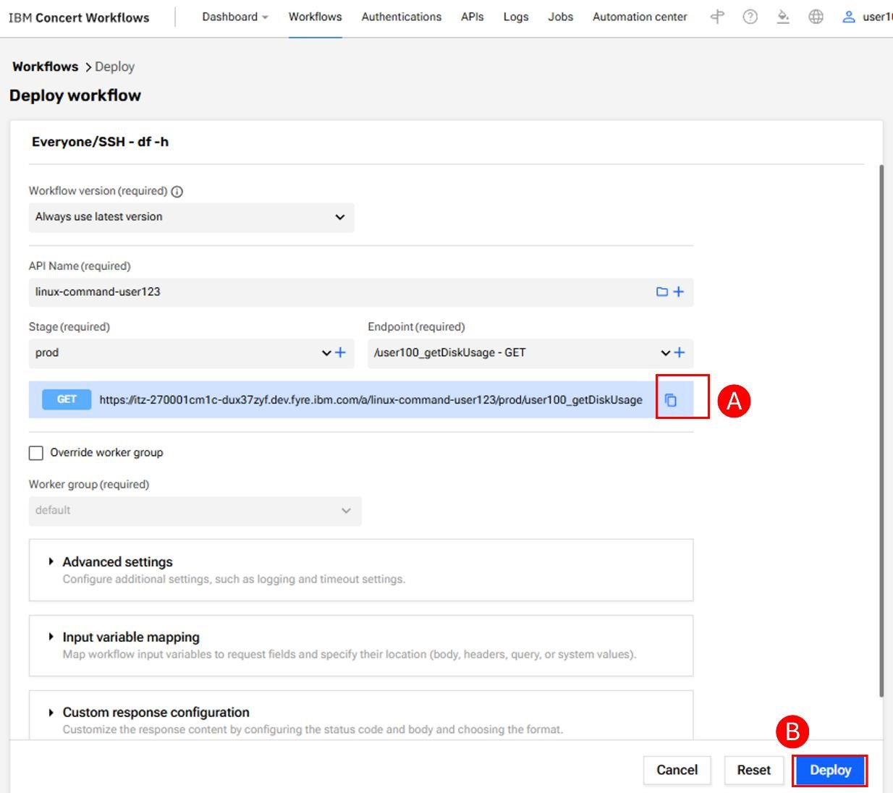

9.	Now, you can paste the URL into your browser to run the workflow and see the result. 
 
    **Action: Open a new browser tab, paste the URL (A) into your browser, and notice the result (B). Return to the Concert Workflows browser tab.**

    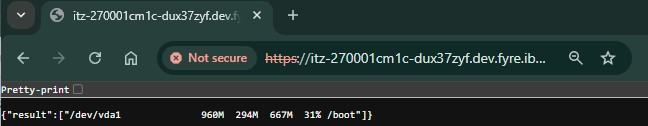

10.	If you go back to the APIs page in Concert Workflows, you can also get the Swagger build-out for the endpoint. 
 
    **Action: Click the APIs (A) link on the top of the page, click your dedicated API linux-commanduser123 (B) API, and then click the Swagger (C) button.**

    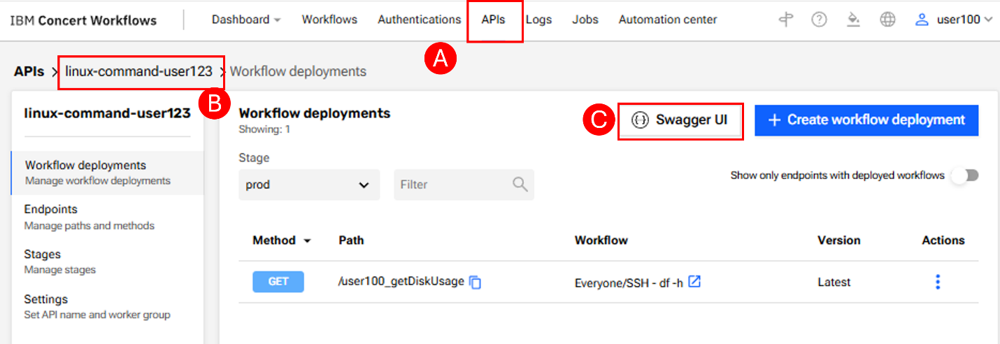

11.	Within the Swagger, you can see the user123/getDiskUse endpoint and can even try it out. 
 
    **Action: Point to your dedicated user123/getDiskUsage (A) endpoint and click the Try it out (B) button. Click the Execute (C) button and point to the Response body (D).**

    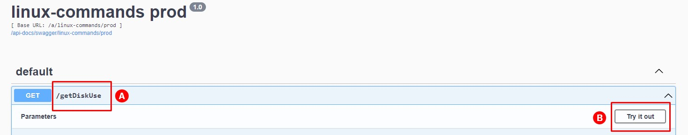
    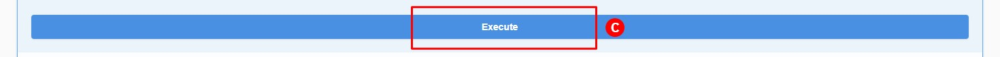
    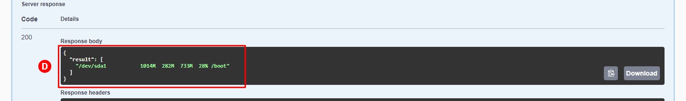

12.	The other way to leverage the workflow is through the Automation Center, where you can limit usage by applying role-based access controls to your workflows. 
 
    **Action: Click the Automation Center (A) link on the top of the page.**

    

13.	To start, you need to create a panel for the API in the Automation Center. To create the panel, you need to provide a name, but you can also provide a meaningful description and even a representative icon. 
 
    **Action: Click the Create Panel (A) button. Enter the Title (B) Linux Commands User123 and the Description (C) Commands for Linux hosts.  
Download the linux pinguin PNG from [this page](https://penguine.png). 
Upload the Icon (D) LinuxPenguin.png and click the Create (E) button. Finally, click the new Linux Commands (F) panel.**

    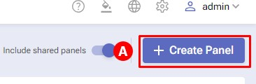
    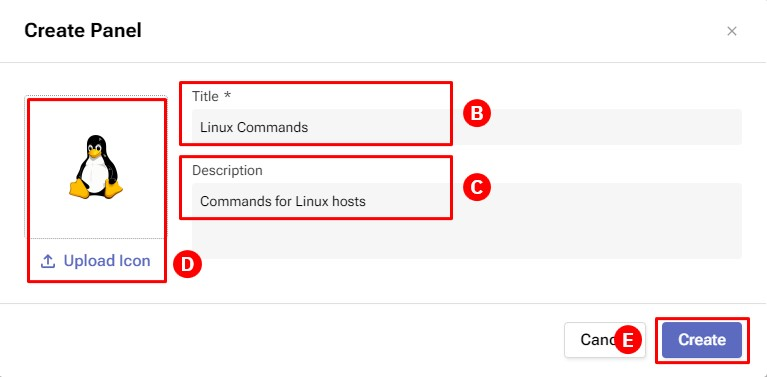
    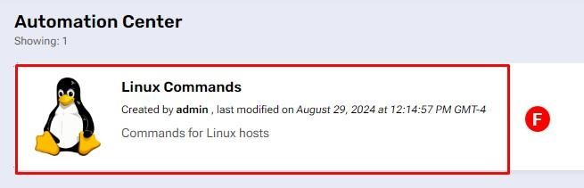

14. Next, you need to create a tile for the panel.

    **Action: Click the Create Tile (A) button. Click on the file icon next to the Workflow (required) field and choose Shared -> admin -> User -> HandsOn Lab 1 -> SSH-df-h.**

    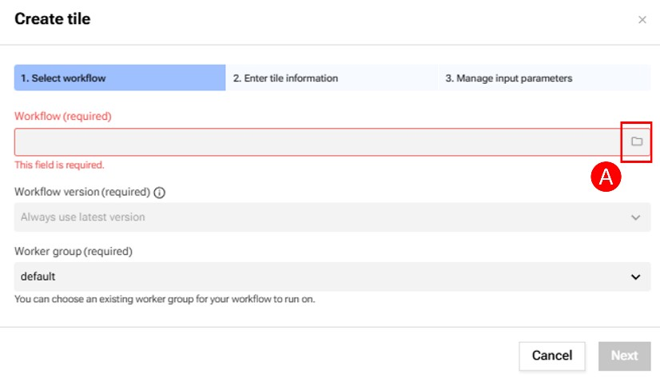

    **Select the workflow (B) admin/User/HandsOn Lab 1/SSH - df -h and click the Next (C) button. Enter the Title (D) ‘User123 Disk Utilization’ with your username and click the Next (E) button. Click the Create (F) button.**

    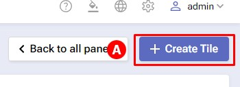
    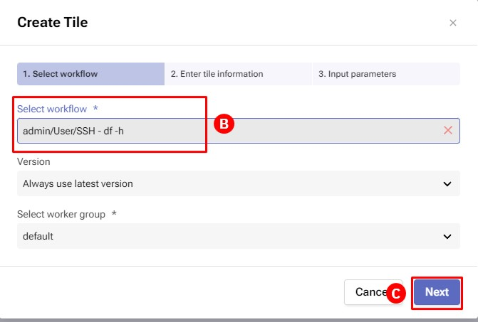
    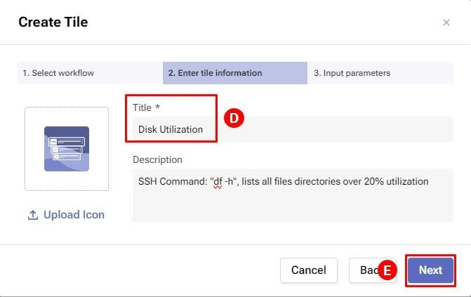
    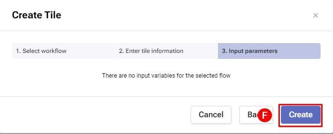

15. Now, you can execute the workflow and get the same result that you have seen several times now. 
 
    **Action: Click the User123 Disk Utilization (A) tile. Click the Run (B) button and point at the Result (C). Click the Cancel (D) button.**

    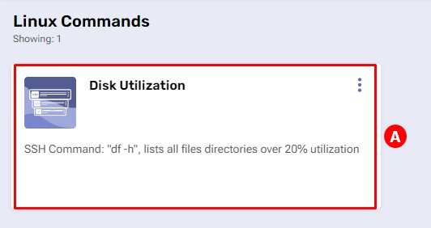
    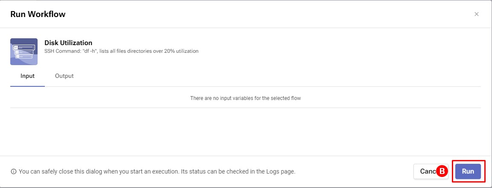
    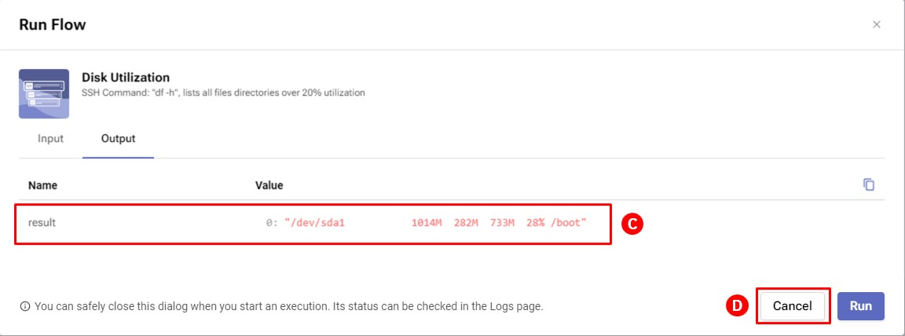

#### 1.6	Logging and ROI dashboard 
1.	The system logs all the executions that are done within it, and it tells you exactly who ran them, from where they were run, such as the API Gateway or Automation Center, and how long they took to run. It also includes a unique identifier for each log. So, if you want to send off logs to a centralized location, such as a Splunk or centralized monitoring solution, you can do that quickly. 
 
    **Action: Click the Logs (A) link at the top of the page. Click the Description (B) of any log. Point to the Executed by (C), the Executed from (D), and the Time started and ended (E) fields for the expanded log. Finally, observe the Log identifier (F) for the expanded log.**

    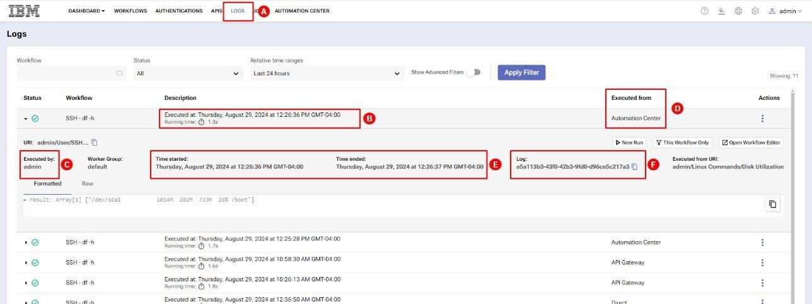

2.	Your final stop on today’s tour is the return on investment or ROI dashboard, where you can see the different executions that are being performed across the platform, how often they're being executed, how much time they're saving, as well as any failed executions. 
 
    **Action: Click the Dashboard (A) link and the ROI (B) option on the top of the page. Notice the Executions today (C) and Time saved today (D) tiles, as well as the other tiles on the page.**

    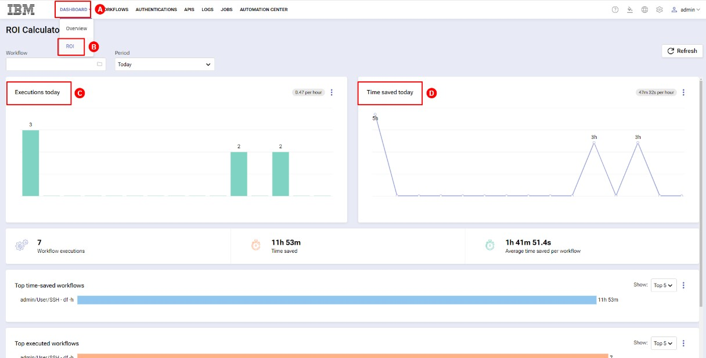

3.	This concludes your tour of Concert Workflows. Thank you for your time. 
### 2. Getting help and troubleshooting 
If you require assistance, ask your questions to the instructor or ask the colleagues who are assisting the session in your location.  
