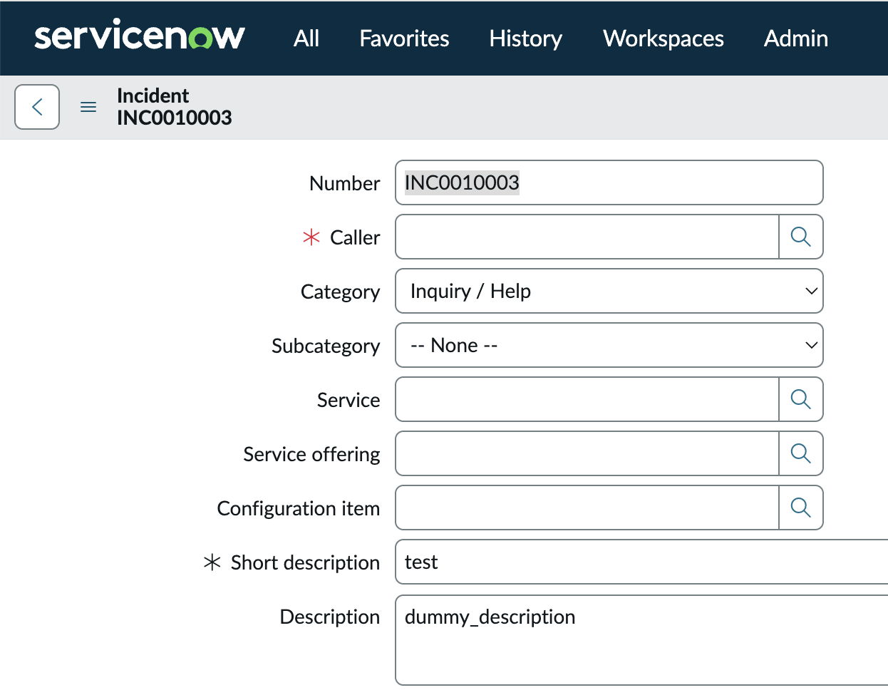

# IBM INNOVATION DAY

October 22, 2025

# Zero to Workflow: Create Fast with Low-Code/No-Code Magic


## Where Code Meets Concert – Exercise Guide 2

### 2. Concert Workflows Exercise

This workshop will show beginners of the product the value of Concert Workflows by rapidly integrating different tools and orchestrating actions across them using a low-code interface. Users will be able to experience firsthand the various ways a workflow can be deployed and triggered.
The workshop is broken into four stages. The setup has already been done for ServiceNow and watsonx.
Each of the stages builds on the previous one. At the end of a workshop, you will have created an automation that will create a ServiceNow ticket, with an enhanced description using the GenAI capabilities of watsonx.
Some concepts like creating variables, assign block, opening a workflow, and the steps to create your workflow is not covered in this workshop. To learn the basics of the platform, please complete [Lab 1](./20250709_Concert_Lab1_Guide.md) first.

#### 2.1	Add text generation task for Watsonx 
1.	Create a new workflow

    Open up the Workflows window and select Create workflow

    Provide a suitable name with your username like **user1-wf-watsonx-access** and click **Create**.

    

    Close the Build your first flow popup window

2.  Add text chat to the workflow 
    In the vendor library, navigate to IBM -> Cloud -> Watson.ai -> Text Chat to find the Text Chat block
    
    

    Drag and drop the Text Chat action block into the flow after the start block (drop it on the + sign underneath).

    

3.  Receive a response from Watson

    In the Object Editor of the Text Chat block, find the variable authKey and select the predefined authentication **admin/watsonx** from the drop-down list for the value.

    

    Paste the following watsonx code (gray background) into the **body** field of the **Text Chat** block in Concert Workflow using the Object Editor via the symbol.

    ```json
    {
      "messages": [{
        "role": "user",
        "content": [{
          "type": "text",
          "text": "Hello granite\n"
        }]
      }],
      "project_id": "3f2da66d-8365-4668-843f-91507932107e",
      "model_id": "ibm/granite-3-3-8b-instruct",
      "frequency_penalty": 0,
      "max_tokens": 2000,
      "presence_penalty": 0,
      "temperature": 0,
      "top_p": 1,
      "seed": null,
      "stop": []
    }
    ```

    Click on the Assign block underneath. Assign the value `$IBM_1.result` to the variable `$result` as seen below.

    

    Save and run the workflow.

    

    The output in the log should look like this.

    

#### 2.2 Send user input to Watson

In this stage, we will use the automation center to manually trigger a workflow and allow users to provide input to our watsonx action block. This input will be sent to watsonx, and we will receive a response that will be displayed to the user.

The goal of the stage is learn to deploy a workflow tile to the automation centre and how to trigger a workflow manually with user input.

1.  Create and use user input variables

    In the same workflow, create a new variable `userInput` of type `String` and default value `test` in the start block that we will use to pass users input to watsonx. Mark it as In (put) and Required.
    >Note, calling variables are case sensitive.

    

    Using the object editor, expand the messages field of the Text Chat block (this can be found under body) and replace the value for key text with the variable content of $userInput

    
    

    This will insert our input variable into the messages text part of the body

    Go back to the Assign node. Assign the `result` variable to value `$IBM_1.result.choices[0].message.content`

    

    This will only save the response text part of the object sentback by watsonx

    Save and run the workflow to test the response.

    

2.  Create a tile in the automation center

   Navigate to the Automation Center using the left navigation bar.

   

    Select Create panel from top right.
    Enter Title as userxyz_deepdive, where xyz is associated with your username.
    Click the Upload image button and upload an image of your choice with max. 100kb e.g. watsonx from [here](https://github.ibm.com/expert-labs-dach/ael-deep-dive-learning-event/blob/main/tbm-deep-dive/watsonx.png)

    Click Create
    

    Open your panel and click Create tile

    **Select your created workflow**, click next and optionally change the title and add a description. Click next again and select the `userInput` variable as **Overridable**. Finally, click **Create*.

    
    
    

3.  Test the automation

    You can now click on the tile and use it as a way to trigger the workflow with input manually. You should receive a response back from watsonx, effectively creating a chatbot without any context ability.

    

    Enter a custom `userInput` value (e.g. `What is a deep dive session?`) for your workflow in the Input tab and click Run to start it.

    

    Watch for the Output returned by watsonx

    

    Click Cancel to leave.

#### 2.3 Automatically create AI-assisted ticket

In this stage, we will add a new vendor to our flow, ServiceNow. The aim is to create a ticket automatically in the Service Desk > Incidents table of our ServiceNow Developer instance.

We will manually trigger the workflow again, accepting user input, and enhance our user input using the GenAI capabilities of watsonx. We will then create the ticket with both the user input and the watsonx enhanced input.

To do this, we should also alter the instructions we send to our watsonx instance. The goal of the stage is to illustrate how quickly multiple platforms can be integrated and actions orchestrated across them. It also illustrates the ability to take the output from one action and have it influence the next action.

1.  Adding Context

    Navigate to **Workflows** and open the workflow you created.
   
    To distinguish the incident tickets from the parallel running workflows of the lab, we will add the username (you are logged in with) as a prefix for the ticket Short description.

    In your workflow open the Common library and drag and drop the **Context** block on the + sign after your Start block. (scroll down or search for Context under Common)

    
    

    Click on the checkbox of the includeRoles variable in the Object Editor tab of the Context block to set it to true

    

    Furthermore drop an Assign block after the Context Block by clicking on the + and select the block from **Quick access**

    

    Assign your current username (retrieved from the context) $Context_1.result.userName to the $result variable for logging

    

    Click on the Text Chat block, set the breakpoint left from the block (switching circle color from blue to red) and run Debug

    
    

    Verify the result with your username in the Debugger tab (expand local -> intermediate -> result)

    

    Click on the stop button and Save the workflow

    

2.  Add a ServiceNow Integration

    In the same workflow (or clone the workflow), create a new  variable called `description` (within the Start block) with flags In and Required and default value like dummy_description

    

    Drag and drop the **createTable** block from the **ServiceNow** library on the plus sign after the existing Assign_1 block.

    
    

    Click the dropdown icon in the **authKey** field of the ServiceNow block and select `admin/ServiceNow` from the list (alternatively you can create your own ServiceNow instance, a new authentication and add your own username/passwords to access it)

    

    In the **tableName** field, enter the following table name (note the correct quotation mark type): `'incident'`

    In the **Table** field, paste the following body to set the **short description** as the user input and the longer normal **description** as the AI-enhanced description from watsonx.

    ```json
    {
      "short_description": $userInput,
      "description": $description
    }
    ```

    
    

    Save and Run the workflow.

    You can now view the ticket in the attached [ServiceNow developer instance](https://dev222752.service-now.com/now/nav/ui/classic/params/target/incident_list.do) ([**Username and password information will be provided by the instructors**). Navigate to the Service Desk -> Incidents table using Favorites -> Incidents

    

    You will see your newly created ticket, with the input variable value as a Short description and description variable and Description.

    

3.  Modify chat prompt

    Now we will update the watsonx chat prompt with some more context to generate a good response for our userInput and replace the Description of the incident with the watsonx response.

    Update the input to your watsonx Text Chat action block (text in messages variable) to the following:
    ```txt
    "You are a cautious assistant. You carefully follow instructions. You are helpful and harmless and you follow ethical guidelines and promote positive behavior. Your response should only include the answer. Do not provide any further explanation. You should provide concise descriptions of IT issue provided to you. You should also provide a suggestion as to how to fix it the following problem:" + $userInput + "\n"
    ```

    
    

    Then open the ServiceNow block

    Add the `$Context_1.result.userName` as a prefix to the **short_description** value of Table `$Context_1.result.userName + ":" + $userInput` and exchange the **description** with the value of the variable `$IBM_1.result.choices[0].message.content` from the Text Chat block

    

    Click Save and Run and verify again your incident ticket in ServiceNow.

    

4.  Create tile for the AI assisted ticket workflow

    On Concert Workflows, navigate to your panel userxyz_deepdive in the Automation Center (exchanging xyz everywhere with your number)

    

    Create a new tile with your workflow and call it userxyz_create_AI_enhanced_ticket or similar. Remember to set userInput as overridable.

    

    Run the tile, and use “I cant log into my SAP account” or something similar as input to test and verify the output of your workflow

    
    

    Navigate to your ServiceNow developer instance and look out for this new incident (if it does not show up automatically click on the hamburger on the top left and select Refresh List to update the list)

    

    View your automatically created ticket, with a short description as your input and a long description as the WatsonX response that includes a description of the issue as well as the next steps to fix it. This may help IT  operations resolve issues faster.

    

#### 2.4 Create ticket via API

In this stage, we will trigger our workflow using its API endpoint. All workflows in CW can have its own API endpoint to trigger it remotely. We will use our existing workflow, create a new API, and trigger that workflow via the API endpoint.

The goal of this stage is to illustrate how easily your can call your automation via its API endpoint. This allows other platforms to instantly gain the ability to automate actions if they can trigger CW. Not shown in this workshop is the ability to schedule a workflow, to trigger it automatically whenever you set it.

1.  Deploy Workflow

    Clone the workflow you created, call it userxyz-create-ticket-via-API (exchange your username everywhere)

    
    

    Open up the cloned workflow.

    Select the **Deploy Workflow** form the **Workflow actions** drop-down.

    

    In the **API Name** field, click the plus icon to create a new API and give the API a name, like userxyz-create-ticket and click Create

    

    Create a new **Stage** called **prod** (+ icon)

    

    Create a new **Endpoint** (+ icon), selecting the method as **Get** and path **/userxyz-create-ticket**

    

    Under the Input variables mapping menu, select **Enable** for the `userInput` variable. The request part should be **Query Parameters**. Change the Field name to **Issue**.

    
    
    

    Click Deploy.

2.  Change Authentication method

    Navigate to the APIs tab in the navigation bar. Note: All workflows created can be called via fully productionized APIs. Swagger documentation can be viewed when clicking on the Swagger UI button.

    

    Click on your API and select **Settings** on the left-hand side menu.

    

    Under the Authentications menu, set authentication as Anonymous. Save.

    

3.  Calling the API
    
    You can now call this API endpoint without needing to authenticate. Try it out by pasting the following into your browser:

    ```text
    <YourApiPath>?Issue=Cant+read+my+emails+on+my+iphone
    ```
    >Hint: You can get the API Path from Workflows deployments
    >

    The response in your browser should look like below.

    ```json
    {"result":"1. Issue: Inability to read emails on iPhone.\n2. Suggestion: Check email account settings, ensure internet connection is active, restart iPhone, or sign out and sign back into the email account. If persistent, update iOS or contact Apple Support."}
    ```

    This illustrates how any system can trigger automation via API, and orchestrate various actions together.

Congratulations - you completed the Lab.

#### 2.5 Conclusion
